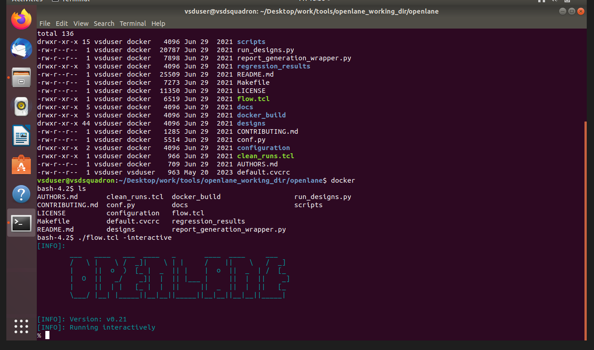

## Day 1: Inception of Open-source EDA, OpenLANE, and Sky130 PDK

### RTL to GDSII Flow
The RTL to GDSII flow is the process of translating a logical Register Transfer Level (RTL) design into a physical layout (GDSII) ready for fabrication. OpenLANE is an automated RTL to GDSII flow built around open-source tools like Yosys, OpenROAD, Magic, and OpenSTA. 

### Invoking OpenLANE
The first step is to invoke the OpenLANE docker container and start the interactive flow.



### Running Synthesis
Logic synthesis translates the RTL code into a gate-level netlist using standard cells from the Sky130 PDK. 

To run synthesis, the following commands are used:
```tcl
prep -design picorv32a
run_synthesis
